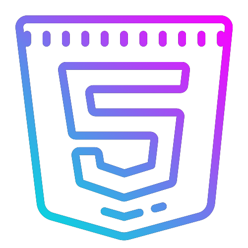
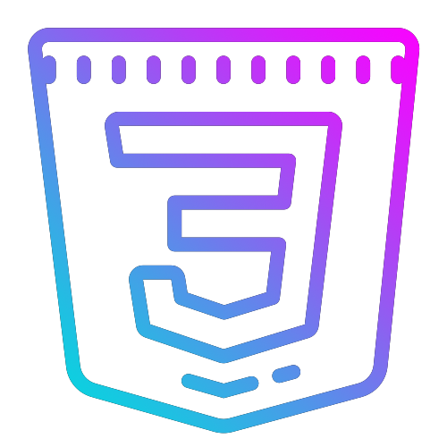
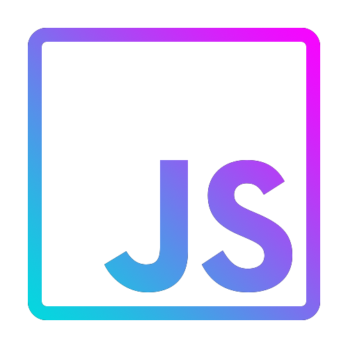
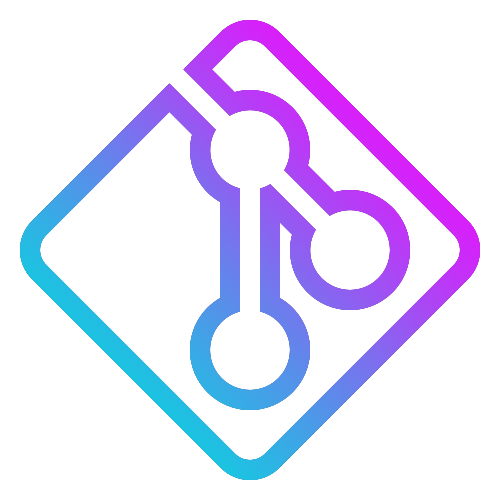
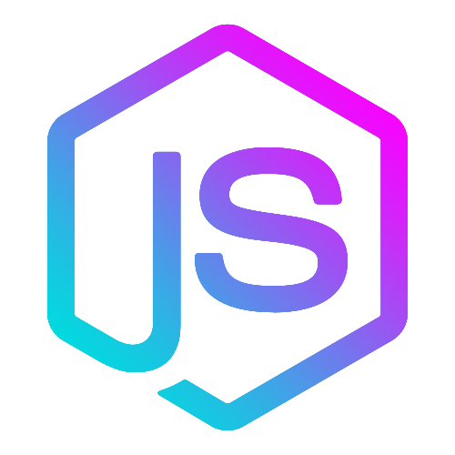
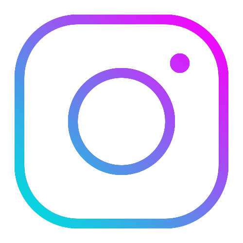
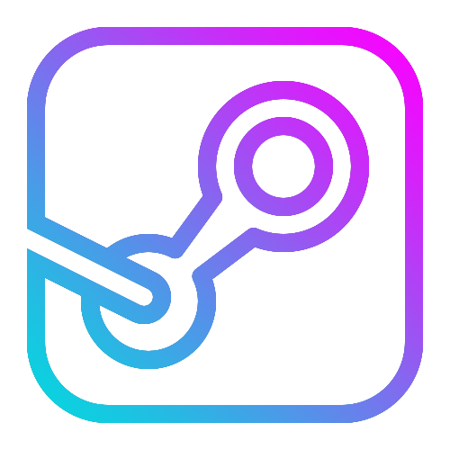

<pre>
    <strong>
        The logos in this repo were edited by me. If you need, you are safe to use them.
    <strong>
</pre>

 

# **Icon Table**

| HTML | CSS | Javascript | React | 
| :----: | :----: | :----: | :----: | 
|  |  |  |  |

| Bootstrap | Tailwind | Git | Github |
| :----: | :----: | :----: | :----: | 
|  |  |  |  |

| Java | NodeJS | PostgreSQL | MongoDB | 
| :----: | :----: | :----: | :----: | 
|  |  |  |  |

| Instagram | Steam | Twitter | LinkedIn | 
| :----: | :----: | :----: | :----: | 
|  |  |  |  |

| Hackerrank | Gmail | VS Code | 
| :----: | :----: | :----: | 
|  |  |  |

